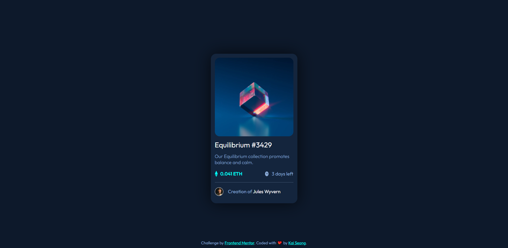

# ✨ NFT Preview Card Component

This is a solution to the [NFT Preview Card Component challenge on Frontend Mentor](https://www.frontendmentor.io/challenges/nft-preview-card-component-SbdUL_w0U).

## ❓ The challenge

Users should be able to:

- View the optimal layout depending on their device's screen size
- See hover states for interactive elements

## 📸 Screenshots



## 🔗 Links

- [Solution URL](https://www.frontendmentor.io/solutions/nft-preview-card-component-using-css-flexbox-HJVddKSB5)
- [Live Site URL](https://nft-preview-card-component-bfc.pages.dev/)

## 😓 What I Struggled With

1. Positioning of elements (CSS Units/Pseudo-elements/Position)

## 💗 What I Learnt
 - using the `::before` and `::after` psuedo-element
```css
.card .img-wrapper::before {
    content: '';
    position: absolute;
    background-color: var(--Cyan);
    width: 100%;
    height: 100%;
    opacity: 0;
    border-radius: 18px;
    z-index: 2;
}

.card .img-wrapper:hover::before {
    transition: 0.3s ease;
    opacity: 0.5;
}

.card .img-wrapper::after {
    content: '';
    position: absolute;
    background-image: url("./images/icon-view.svg");
    background-repeat: no-repeat;
    background-position: center;
    width: 100%;
    height: 100%;
    transform: translate(0, -100%);
    opacity: 0;
    z-index: 3;
}

.card .img-wrapper:hover::after {
    opacity: 1;
    transition: 0.3s ease-in-out;
}
```
